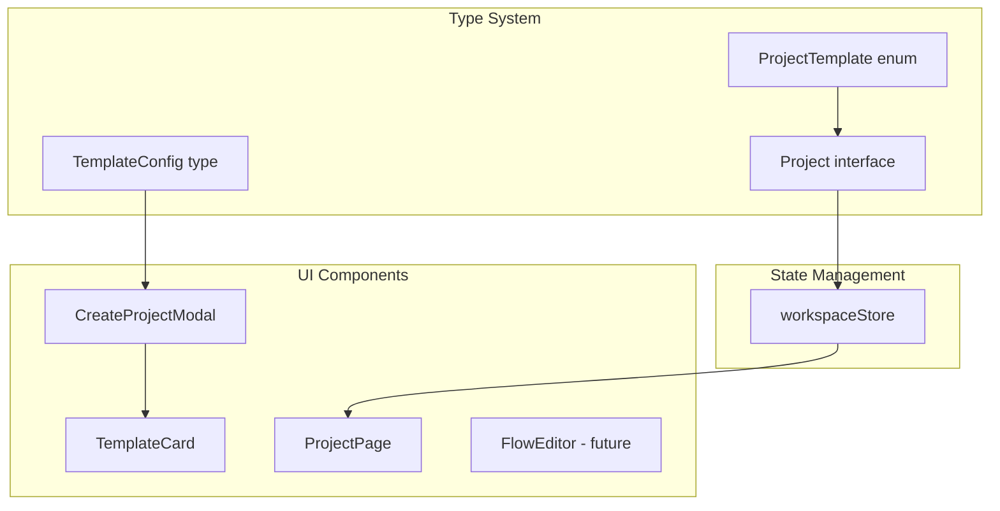

# Project Templates Implementation

## Overview

Add a template selection system to the project creation flow. Users can choose from 5 templates:

1. **Python Package** - Reusable Python library (future: importable by other workspace projects)
2. **FastAPI** - Python REST API
3. **Dagster ETL** - Data orchestration with assets and schedules
4. **Prefect ETL** - Workflow orchestration with flows and tasks
5. **Dagu ETL** - Lightweight YAML-based workflow engine

Only ETL projects (Dagster, Prefect, Dagu) will have React-Flow visual editing capabilities.

## Architecture




## Implementation Steps

### Step 1: Define Template Types and Configurations

Update `[src/types/workspace.ts](src/types/workspace.ts)`:

```typescript
export type ProjectTemplate = 
  | 'python-package'
  | 'fastapi'
  | 'dagster'
  | 'prefect'
  | 'dagu';

export interface Project {
  // ... existing fields
  template: ProjectTemplate;
  supportsVisualEditor: boolean; // true for ETL projects
}
```

Create `[src/types/templates.ts](src/types/templates.ts)` with template configurations:

```typescript
export interface TemplateConfig {
  id: ProjectTemplate;
  name: string;
  description: string;
  icon: LucideIcon;
  category: 'library' | 'api' | 'etl';
  supportsVisualEditor: boolean;
  defaultFiles: string[]; // For future API integration
}
```

### Step 2: Refactor CreateProjectModal with Multi-Step Flow

Transform `[src/components/CreateProjectModal.tsx](src/components/CreateProjectModal.tsx)` into a multi-step modal:

- **Step 1**: Template selection (grid of template cards)
- **Step 2**: Project details (name, description, Python version)

Key UI features:

- Template cards with icons, names, descriptions, and category badges
- Visual distinction for ETL templates (show "Visual Editor" badge)
- Back/Next navigation between steps
- Responsive grid layout for template selection

### Step 3: Create TemplateCard Component

Create `[src/components/TemplateCard.tsx](src/components/TemplateCard.tsx)`:

- Displays template icon, name, description
- Shows category badge (Library, API, ETL)
- Shows "Visual Editor" indicator for ETL templates
- Selection state with visual feedback

### Step 4: Update Workspace Store

Update `[src/stores/workspaceStore.ts](src/stores/workspaceStore.ts)`:

- Update `addProject` to include template
- Update mock data to include template field

### Step 5: Update WorkspacePage

Update `[src/pages/WorkspacePage.tsx](src/pages/WorkspacePage.tsx)`:

- Update `handleCreateProject` to accept template parameter
- Pass template to new project creation

### Step 6: Update ProjectCard Component

Update `[src/components/ProjectCard.tsx](src/components/ProjectCard.tsx)`:

- Display template icon based on project template
- Show template badge/label

### Step 7: Prepare ProjectPage for Visual Editor (Foundation)

Update `[src/pages/ProjectPage.tsx](src/pages/ProjectPage.tsx)`:

- Add conditional rendering based on `supportsVisualEditor`
- Add placeholder/tabs for future React-Flow integration
- ETL projects: show tabs for "Visual" and "Code" views
- Non-ETL projects: show only code editor

## Template Configurations


| Template       | Icon        | Category | Visual Editor | Key Files                           |
| -------------- | ----------- | -------- | ------------- | ----------------------------------- |
| Python Package | `Package`   | library  | No            | `src/__init__.py`, `pyproject.toml` |
| FastAPI        | `Zap`       | api      | No            | `app/main.py`, `app/routers/`       |
| Dagster        | `GitBranch` | etl      | Yes           | `definitions.py`, `assets.py`       |
| Prefect        | `Workflow`  | etl      | Yes           | `flows/main.py`, `tasks/`           |
| Dagu           | `FileCode`  | etl      | Yes           | `workflows/*.yaml`                  |


## Files to Create/Modify

**New Files:**

- `[src/types/templates.ts](src/types/templates.ts)` - Template type definitions and configurations

**Modified Files:**

- `[src/types/workspace.ts](src/types/workspace.ts)` - Add `template` and `supportsVisualEditor` to Project
- `[src/components/CreateProjectModal.tsx](src/components/CreateProjectModal.tsx)` - Multi-step modal with template selection
- `[src/components/ProjectCard.tsx](src/components/ProjectCard.tsx)` - Show template info
- `[src/stores/workspaceStore.ts](src/stores/workspaceStore.ts)` - Update store types
- `[src/pages/WorkspacePage.tsx](src/pages/WorkspacePage.tsx)` - Handle new creation flow
- `[src/pages/ProjectPage.tsx](src/pages/ProjectPage.tsx)` - Conditional visual editor UI

## Git Workflow

Work on branch `feat/add-project-templates`. Commits:

1. `feat(types): add project template types and configurations`
2. `feat(ui): implement template selection in CreateProjectModal`
3. `feat(ui): update ProjectCard to display template info`
4. `feat(store): update workspace store for templates`
5. `feat(pages): update WorkspacePage and ProjectPage for templates`

## Future Considerations (Not in Scope)

- Backend API integration via Kubb-generated hooks
- Template file scaffolding
- Project import capabilities across workspace

